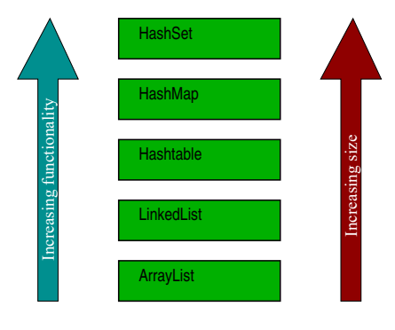
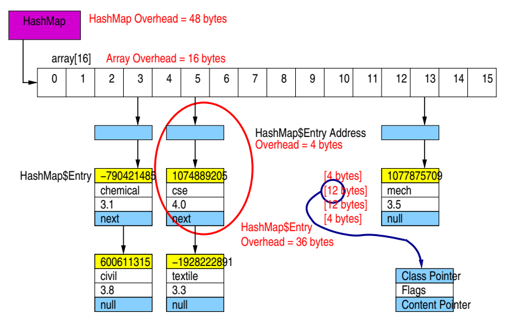
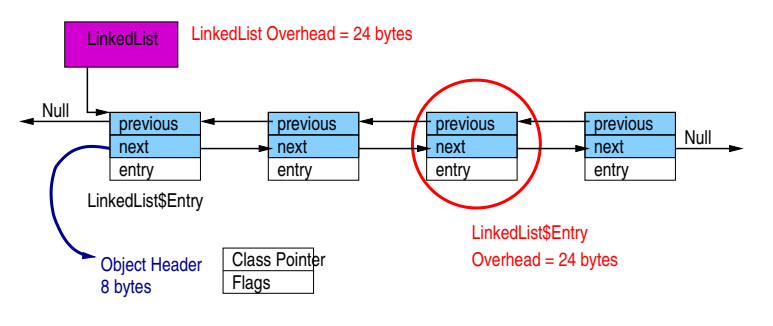
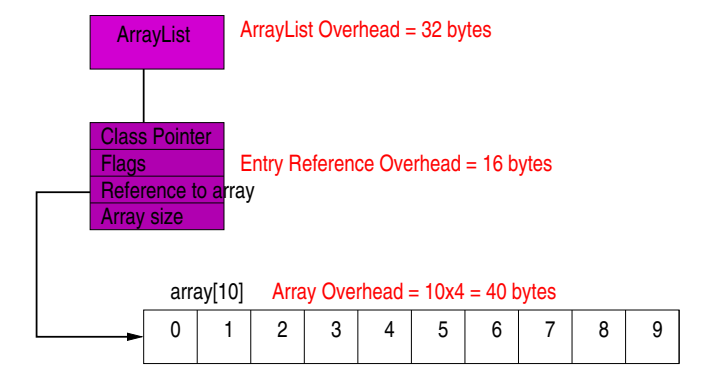

# Java  Collection

- Composite data structures are used to store and manipulate related data.
- In OOP, a composite data structures must group together a set of individual objects and represent them as a single
  entity
- **ADT** (Abstract Data Type) is a data type that is defined by the operations that can be performed on it. They do not
  specify how the data is stored or how the operations are implemented.
- The Java Collections Framework provides similar methods for similar operations on different types of collections.

## Collection Hierarchy

## Map Hierarchy

## Advantages of Frameworks

- Reduces programming effort.
- Increases program speed and quality.
- Consistency in API.

## Performance Characteristics

### Initial Capacity and Load Factor

- **Initial Capacity**: The number of buckets in the hash table.
- **Load Factor**: The ratio of the number of elements to the number of buckets.
- **Threshold**: The product of the load factor and the current capacity.
- **Rehashing**: The process of doubling the capacity of the hash table.

### HashMap

- **HashMap<K, V>** is a hash table based implementation of the Map interface.
- **Initial Capacity**: 16
- **Load Factor**: 0.75
- Implemented using an array of HashMap$Entry objects.
- Overheads:
    - **HashMap**: 48 bytes
    - **Array object**: 16 bytes
    - **Array entries**: 64 bytes
    - **HashMap$Entry**: 36 bytes
- Empty HashMap: 128 bytes

### LinkedList

- **LinkedList<E>** is a doubly linked list implementation of the List interface.
- **Default Capacity**: 1
- Implemented using a linked list of LinkedList$Entry objects.
- Overheads:
    - **LinkedList**: 24 bytes
    - **LinkedList$Entry**: 24 bytes
- Empty LinkedList: 48 bytes

### ArrayList

- **ArrayList<E>** is a resizable array implementation of the List interface.
- **Default Capacity**: 10
- Implemented using an array of Object objects.
- Overheads:
    - **ArrayList**: 32 bytes
    - **Array reference**: 16 bytes
    - **Array entries**: 40 bytes
    - **ArrayList$Entry**: 24 bytes
- Empty ArrayList: 88 bytes
- If the structure runs out of space when attempting to insert a new item, a bigger-sized structure is created by
  allocating new memory from the heap with current memory contents copied to the newly allocated space.

## Overhead Comparison

## Summary

* Hash-based collections have a much larger overhead.
* Additional data stored in hash-based collections improve the performance of search for items and therefore insertion
  and deletion.
    * Search time is **constant** for hash-based collections most of the time
    * Search time is **linear** for array collections
* Carefully evaluate the memory footprint and run-time performance trade-off when deciding on a collection for data
  storage
* Collections expand by **computationally expensive reallocation**.
* Collections nearly always **does not automatically shrink** when items are removed as it imposes a heavy performance
  penalty
